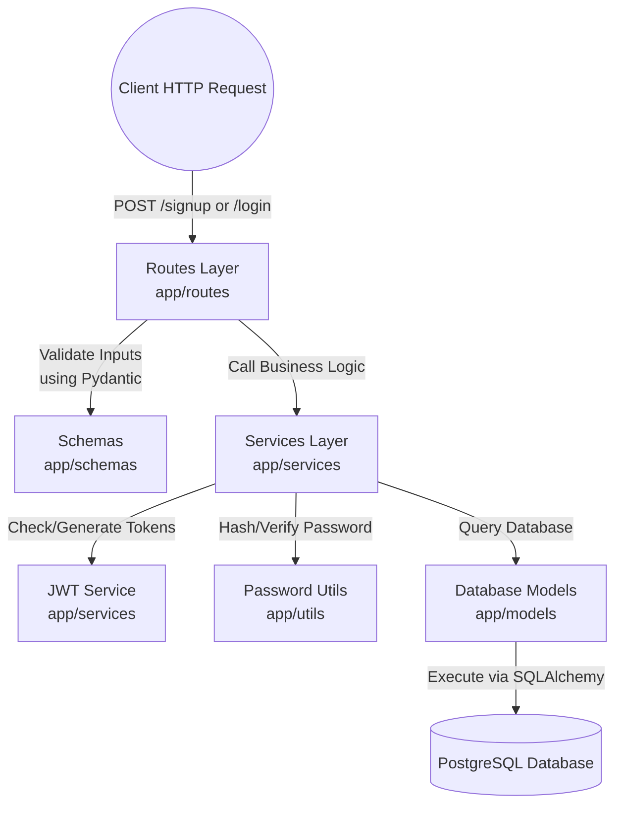

# FastAPI Authentication Microservice - Walkthrough

## Summary 
The Authentication Microservice has been successfully built utilizing a Service-Oriented Architecture (Controller-Service-Model). The system uses **FastAPI** as the web framework and connects to your local **PostgreSQL** instance to handle records securely.

## Setup and Installation

1. **Clone the repository**
   ```bash
   git clone <repository-url>
   cd auth_service
   ```

2. **Set up virtual environment (optional but recommended)**
   ```bash
   python -m venv venv
   source venv/bin/activate  # On Windows use `venv\Scripts\activate`
   ```

3. **Install dependencies**
   ```bash
   pip install -r requirements.txt
   ```

4. **Environment Variables Configuration**
   Create a `.env` file in the root directory and populate it with your configuration. Here is a template matching the expected variables:

   ```env
   # Database Settings
   POSTGRES_USER=postgres
   POSTGRES_PASSWORD=admin123
   POSTGRES_DB=auth_db
   POSTGRES_SERVER=localhost
   POSTGRES_PORT=5433

   # Application Settings
   PROJECT_NAME="FastAPI Auth Microservice"
   VERSION="1.0.0"
   API_V1_STR="/api/v1"

   # Security Settings
   # Generate a new secret key using: openssl rand -hex 32
   SECRET_KEY=09d25e094faa6ca2556c818166b7a9563b93f7099f6f0f4caa6cf63b88e8d3e7
   ALGORITHM=HS256
   ACCESS_TOKEN_EXPIRE_MINUTES=30
   ```

## System Features Implemented
- **Project Structure**: Clean separation between `routes`, `services`, and `models`.

```text
auth_service/
├── app/
│   ├── config/          # Environment & settings
│   │   └── settings.py
│   ├── database/        # DB Session & Base connections
│   │   ├── base.py
│   │   └── session.py
│   ├── models/          # SQLAlchemy Database Models
│   │   └── user.py
│   ├── routes/          # API Controllers & Endpoints
│   │   └── auth_routes.py
│   ├── schemas/         # Pydantic Request/Response Models
│   │   └── user_schema.py
│   ├── services/        # Core Business Logic
│   │   ├── auth_service.py
│   │   └── jwt_service.py
│   ├── utils/           # Helper Utilities
│   │   ├── dependencies.py
│   │   └── password.py
│   └── main.py          # FastAPI Application Instance
├── alembic/             # Database Migration Scripts
├── alembic.ini          # Alembic Config
├── requirements.txt     # Python Dependencies
└── .env                 # Environment Variables
```

### Data Flow Architecture
The system employs a classic `Controller -> Service -> Data` layers approach commonly seen in enterprise apps (e.g. Netflix/Uber):



- **Database**: Entity models created via SQLAlchemy and schema migrations managed through `alembic`.
- **Security**: 
  - Standard User Signup and OAuth2 Login flows.
  - JWT token generation/validation (using `python-jose`).
  - Secure password hashing natively via `bcrypt`.

## Logging Integration
A centralized logger is configured in `app/utils/logger.py` to trace system events and errors. The logger outputs a standardized format to the terminal console:
- **Format**: `%(asctime)s - %(name)s - %(levelname)s - %(message)s`
- **Current usage**:
  - `main.py`: Logs startup and shutdown events via standard lifespan context manager.
  - `auth_routes.py`: Logs successful user signups, login attempts, and failed authentications. 
To add logging to any new module, simply import the logger instance: 
`from app.utils.logger import logger`

## Validation Results
We performed manual integration testing against the live local endpoints:
1. **User Signup**: Registration of new users hashes the password securely and stores it.
   ```json
   POST /api/v1/signup
   {"email":"test@example.com","id":1,"is_active":true}
   ```
2. **User Login**: Validating the created credentials generates a standardized JWT Bearer Token.
   ```json
   POST /api/v1/login
   Token: eyJhbGciOiJIUzI1...
   ```
3. **Protected APIs**: Making requests using the generated Bearer Token successfully authenticates and returns current user details.
   ```json
   GET /api/v1/me
   {"email":"test@example.com","id":1,"is_active":true}
   ```

## Next Steps
The API is currently running locally on `http://127.0.0.1:8000`. You can test it out interactively using FastAPI's automatic Swagger UI at [http://127.0.0.1:8000/docs](http://127.0.0.1:8000/docs).
