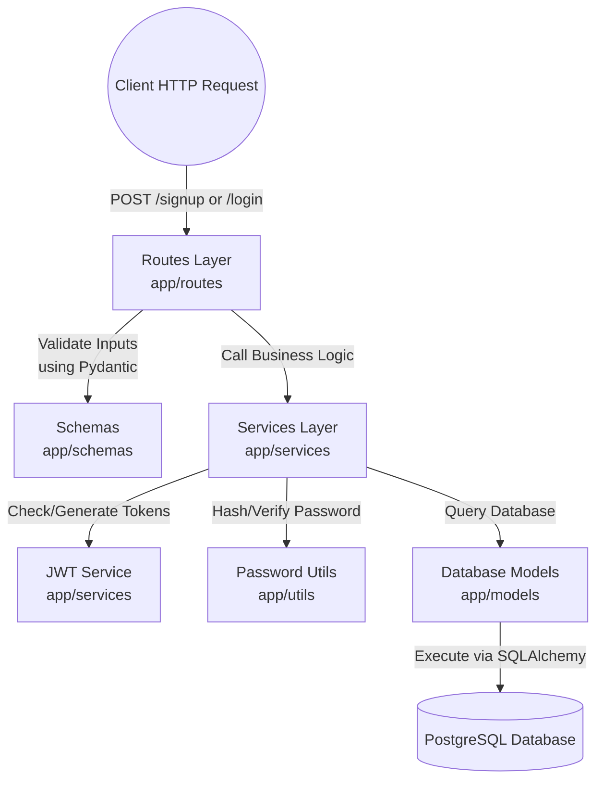

# FastAPI Authentication Microservice - Walkthrough

## Summary 
The Authentication Microservice has been successfully built utilizing a Service-Oriented Architecture (Controller-Service-Model). The system uses **FastAPI** as the web framework and connects to your local **PostgreSQL** instance to handle records securely.

## System Features Implemented
- **Project Structure**: Clean separation between `routes`, `services`, and `models`.

```text
auth_service/
├── app/
│   ├── config/          # Environment & settings
│   │   └── settings.py
│   ├── database/        # DB Session & Base connections
│   │   ├── base.py
│   │   └── session.py
│   ├── models/          # SQLAlchemy Database Models
│   │   └── user.py
│   ├── routes/          # API Controllers & Endpoints
│   │   └── auth_routes.py
│   ├── schemas/         # Pydantic Request/Response Models
│   │   └── user_schema.py
│   ├── services/        # Core Business Logic
│   │   ├── auth_service.py
│   │   └── jwt_service.py
│   ├── utils/           # Helper Utilities
│   │   ├── dependencies.py
│   │   └── password.py
│   └── main.py          # FastAPI Application Instance
├── alembic/             # Database Migration Scripts
├── alembic.ini          # Alembic Config
├── requirements.txt     # Python Dependencies
└── .env                 # Environment Variables
```

### Data Flow Architecture
The system employs a classic `Controller -> Service -> Data` layers approach commonly seen in enterprise apps (e.g. Netflix/Uber):



- **Database**: Entity models created via SQLAlchemy and schema migrations managed through `alembic`.
- **Security**: 
  - Standard User Signup and OAuth2 Login flows.
  - JWT token generation/validation (using `python-jose`).
  - Secure password hashing natively via `bcrypt`.

## Challenges Faced & Debugging Steps
Throughout the implementation, we encountered multiple hurdles which were successfully debugged and resolved:

1. **Docker un-availability**:
   - *Issue:* Initially planned to run PostgreSQL via Docker (`docker-compose up -d --build`), but Docker was not installed on the system.
   - *Fix:* We briefly shifted the plan to use a local `SQLite` database.
2. **Local PostgreSQL Connection**:
   - *Issue:* You mentioned having a local PostgreSQL server running on port `5433`, so we switched back to PostgreSQL.
   - *Fix:* We updated `.env` to connect to `localhost:5433`.
3. **Database Credentials & Creation**:
   - *Issue:* Running `alembic revision --autogenerate` failed multiple times because:
     - First, the default `POSTGRES_PASSWORD="postgres"` failed authentication.
     - Second, even after you updated the password to `admin123` in `alembic.ini` and we synced it with `.env`, we hit a `database "auth_db" does not exist` error.
   - *Fix:* I updated `.env` properly and ran `PGPASSWORD=admin123 createdb -p 5433 -U postgres auth_db` to manually create the database before running the Alembic migration successfully.
4. **Passlib & Bcrypt Compatibility Validation**:
   - *Issue:* During the first API test for `/signup`, we hit a `500 Internal Server Error`. The logs showed `ValueError: password cannot be longer than 72 bytes, truncate manually if necessary`, indicating a known compatibility bug between the newer version of `bcrypt` and the `passlib` context wrapper.
   - *Fix:* Dropped `passlib` completely and rewrote `app/utils/password.py` directly using the native `bcrypt` library (`bcrypt.hashpw` and `bcrypt.checkpw`) which encodes strings to bytes natively. This instantly fixed the hashing process!

## Logging Integration
A centralized logger is configured in `app/utils/logger.py` to trace system events and errors. The logger outputs a standardized format to the terminal console:
- **Format**: `%(asctime)s - %(name)s - %(levelname)s - %(message)s`
- **Current usage**:
  - `main.py`: Logs startup and shutdown events via standard lifespan context manager.
  - `auth_routes.py`: Logs successful user signups, login attempts, and failed authentications. 
To add logging to any new module, simply import the logger instance: 
`from app.utils.logger import logger`

## Validation Results
We performed manual integration testing against the live local endpoints:
1. **User Signup**: Registration of new users hashes the password securely and stores it.
   ```json
   POST /api/v1/signup
   {"email":"test@example.com","id":1,"is_active":true}
   ```
2. **User Login**: Validating the created credentials generates a standardized JWT Bearer Token.
   ```json
   POST /api/v1/login
   Token: eyJhbGciOiJIUzI1...
   ```
3. **Protected APIs**: Making requests using the generated Bearer Token successfully authenticates and returns current user details.
   ```json
   GET /api/v1/me
   {"email":"test@example.com","id":1,"is_active":true}
   ```

## Next Steps
The API is currently running locally on `http://127.0.0.1:8000`. You can test it out interactively using FastAPI's automatic Swagger UI at [http://127.0.0.1:8000/docs](http://127.0.0.1:8000/docs).
